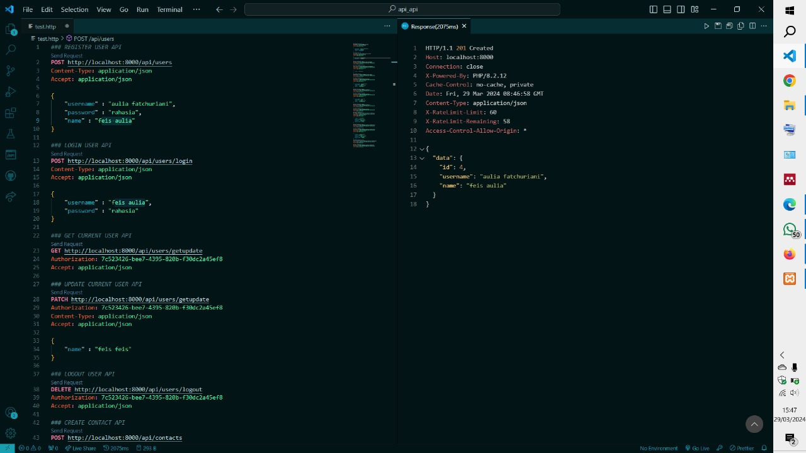
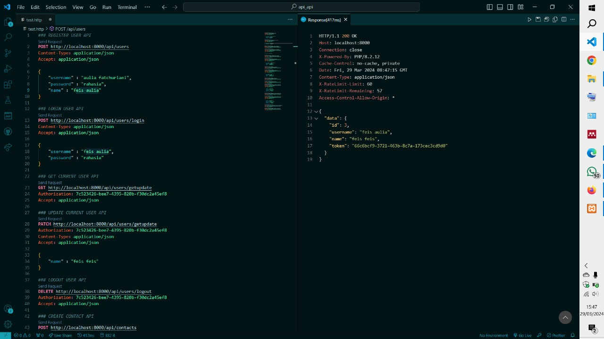
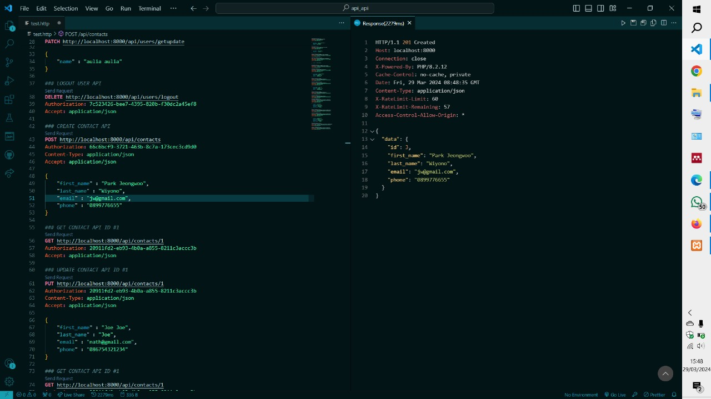
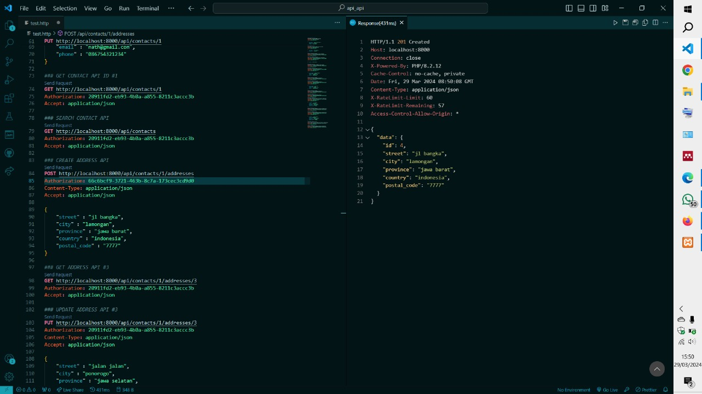

# Ujian Tengah Semester | Restful API Laravel

 
 

> Project ini adalah project praktikum untuk ujian tengah semester yang membuat RESTful API dengan fitur user, contact, dan address. Tujuan dari project ini adalah untuk memperkuat pemahaman dalam pengembangan aplikasi web dengan menggunakan framework Laravel dan konsep RESTful API. Dengan project ini, belajar tentang bagaimana cara membuat endpoint-endpoint API yang dapat melakukan operasi CRUD (Create, Read, Update, Delete) untuk entitas user, contact, dan address. Selain itu, Anda juga akan belajar tentang konsep autentikasi pengguna, validasi input, dan manajemen relasi antar entitas dalam sebuah aplikasi web. Dengan menyelesaikan project ini, diharapkan Anda dapat menguasai dasar-dasar pengembangan aplikasi web dengan menggunakan Laravel dan RESTful API.

### Fitur-fitur
- User: Register, Login, Get User, Update User, Logout User
- Contacs: Create Contact, Get Contact, Update Contact, Search Contact
- Addresses: Create Address, Get Address, Update Address, Remove Address

### Tampilan
- User
   Register
  
   Login
  
- Contacts
  
- Addresses
  

  
